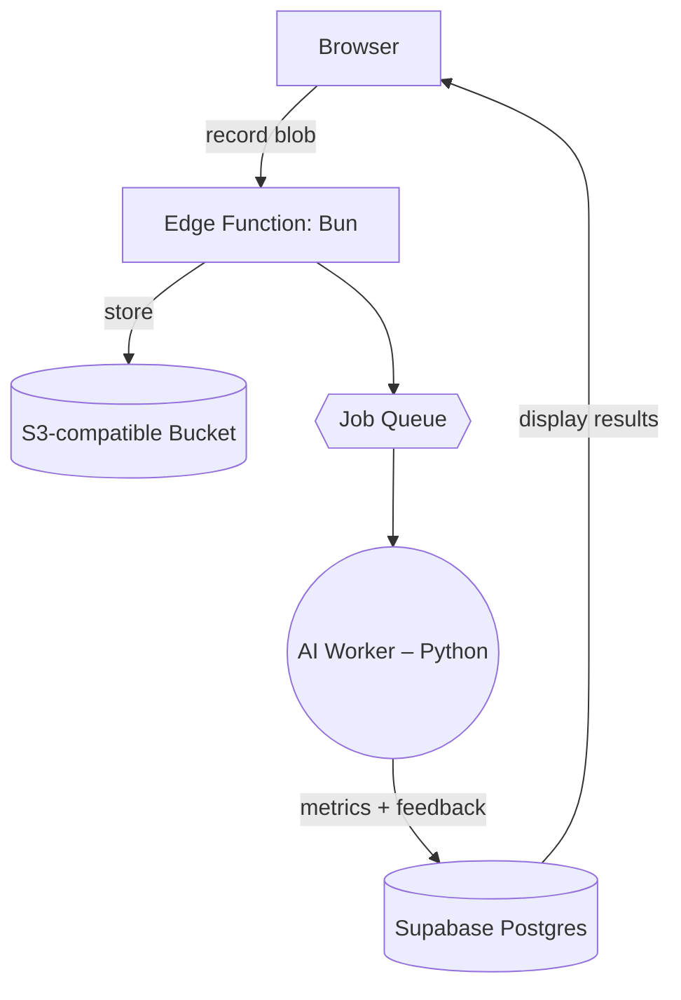
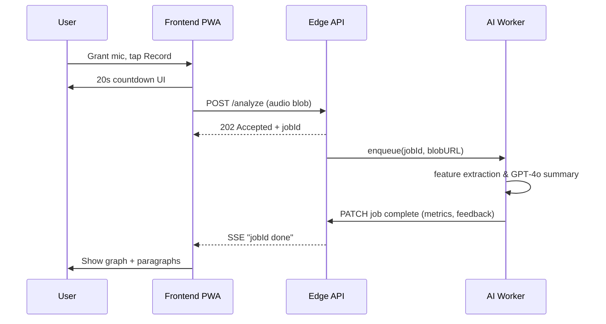

# AI Voice Trainer — MVP OSS Tool Specification

**Version:** 0.1‑draft

**Author:** Ari Gibson

**Created:** 2025‑05‑11

Conceived and developed independently; no proprietary resources were used. Rough draft of a potential future project. Subject to change significantly over the course of evaluation and planning stages.

---

## 1. Purpose & Vision

Open‑source, privacy‑minded PWA that helps transgender and non‑binary people practice voice training with AI assistance.
For the MVP, the goal is **"record → AI analysis → actionable feedback"** in under 2 minutes, on any modern browser. Initial version has minimal features but could eventually be built out into a SaaS platform.

---

## 2. Success Metrics (MVP)

| Metric                             | Target                         |
| ---------------------------------- | ------------------------------ |
| Prototype completed & deployed     | N/A -- unsure                  |
| Voice recording → feedback latency | ≤ 15 s                         |
| Monthly active users (MAU)         | 100+ within 6 months of launch |
| Infra cost                         | ≤ US \$40 / mo                 |

---

## 3. Core User Stories (MVP)

1. **Record** – I press a single button to record a 20‑second voice sample directly in‑browser.
2. **AI Analysis** – The app uploads the sample, runs acoustic analysis, and returns:

   * Pitch contour graph
   * Table of features (fundamental frequency, formant ratio, resonance, inflection index)
   * 1‑3 paragraph friendly summary + next‑step suggestions.
   * Rating system for how close the user is to their "target"
3. **In Browser Storage** - Local browser storage stores references to audio clips and feedback. No signup flow yet.
4. **History List** – I can view a list of my past 10 recordings and re‑read feedback with basic pitch charts.

Non‑Goals (MVP): social sharing, coach marketplace, mobile native offline mode, advanced dashboards, ability to upload existing recordings.

---

## 4. Feature Requirements

### 4.1 Recording Module

* Browser MediaRecorder API (48 kHz mono WAV).
* 20 s max length, auto‑trim silence.

### 4.2 Backend / API

* REST/GraphQL endpoint `/analyze` accepts audio blob.
* Queues job → invokes AI micro‑service.

### 4.3 AI Micro‑service

* *very rough ideas -- this section will require lots of research*
* Pipeline:
  `ffmpeg` downsample → `pyworld`/`praat-parselmouth` extract f0 + formants → ONNX gender‑perception classifier → OpenAI GPT‑4o prompt that crafts human feedback paragraph (system + few‑shot examples).

### 4.4 Storage

* Recordings stored in object bucket with 14‑day TTL (privacy + cost).
* In browser storage for actual analysis, avoids requiring a sign up flow in MVP.

### 4.5 UI / UX

* Astro + React islands (signals) — fast PWA shell.
* Components: RecorderCard, FeatureGraph (d3 / recharts), FeedbackPanel.
* Potentially T4 stack?

### 4.6 Privacy & Security

* End‑to‑end TLS.
* All audio purged after TTL.
* As of now, code viewable but unlicensed -- no usage is authorized. This will change once an appropriate license is chosen.

---

## 5. Architecture Overview

* **Edge functions**: Bun runtime on Vercel or Supabase Edge—minimal cold start.
* **Job queue**: Upstash Redis Q or Supabase Tr pgboss.
* **Worker**: lightweight Python container on Fly.io scale‑to‑zero.

---

## 6. Tech Stack Choices

| Layer           | Pick                                    | Reason                                 |
| --------------- | --------------------------------------- | -------------------------------------- |
| Frontend        | **Astro + React islands**               | PWA, fast static build, easy hydration |
| Styling         | Tailwind CSS                            | familiar, tree‑shakes                  |
| State mgmt      | TanStack Query                          | simple async fetch caching             |
| Backend runtime | **Bun**                                 | personal preference, fast              |
| Auth            | Supabase Auth                           | turnkey social login, free tier        |
| DB              | Supabase Postgres                       | < \$9/mo, GraphQL plug‑in optional     |
| Storage         | Supabase Storage                        | integrated, regional                   |
| Queue           | pg\_boss (built‑in)                     | no extra infra                         |
| AI worker       | Python 3.12 + ONNXRuntime + OpenAI SDK  | leverage existing audio libs           |
| CI/CD           | GitHub Actions → Supabase/Vercel deploy | free tier pipeline                     |

Cost estimate: Supabase Pro \$0 → \$9, OpenAI usage \$5, Fly worker free tier → total ≈ \$14/mo.

---

## 7. User Flow Diagram (Happy Path)

---

## 8. Roadmap Beyond MVP (icebox)

1. Upload existing clips
2. Progressive WebAudio tuner (live pitch)
3. Coach‑mode exercise plans
4. Client‑side ONNX model for pitch/formants (WASM)
5. Native wrapper via T4 App / Capacitor for better mic routing.

---

## 9. Legal & IP Notes

* Developed solely as a community project, no ties or propriatary information used from any past, present, or future employers of primary maintainers.
* As of now, code viewable but unlicensed -- no usage is authorized. This will change once an appropriate license is chosen.
